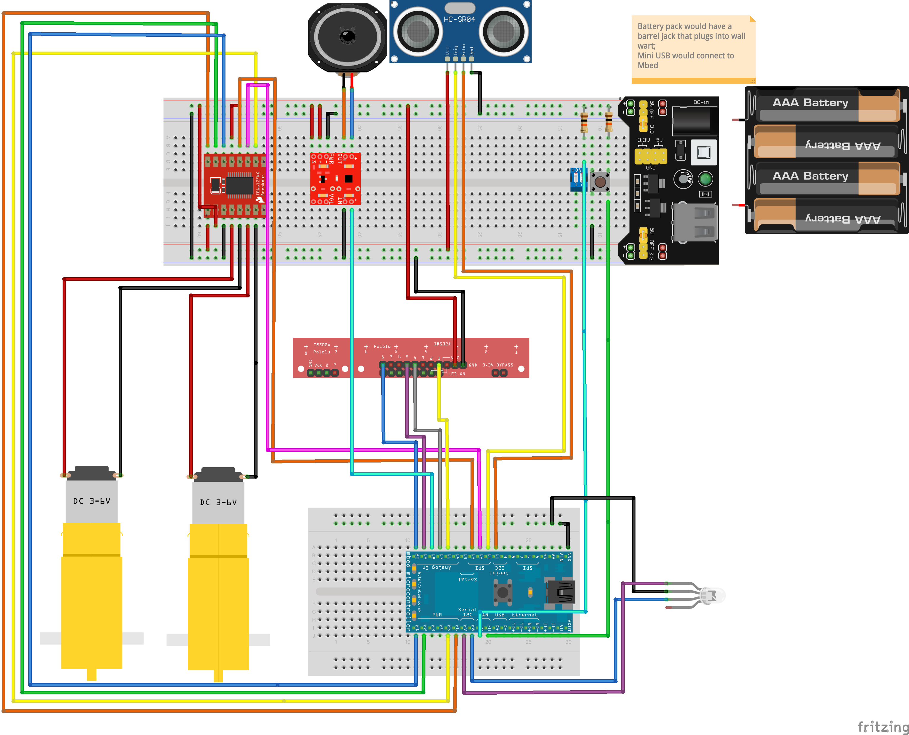

# AutoBot

**ECE 4180 Final Project · William Akins**

> An Mbed-powered autonomous guided vehicle prototype with PID line following, obstacle detection, selectable speed, and audiovisual status feedback.

AutoBot turns a compact, low-cost robotics platform into a practical demonstration of the control systems behind automated guided vehicles (AGVs). The complete firmware is available in [`main.cpp`](./main.cpp).

---

## Introduction

AutoBot is an autonomous line-following robot built around an Mbed microcontroller. After calibrating its reflectance sensors at startup, it follows a black line using closed-loop PID steering. A push button starts or pauses the robot, while an onboard DIP switch provides speed control.

The robot combines navigation with obstacle awareness. An HC-SR04 ultrasonic sensor monitors the path ahead and stops the motors when an object is detected within 20 cm. A red status light and a synthesized horn tone make the obstruction visible and audible.

At the end of the route, AutoBot stops, performs a 180-degree turn, plays a rising success tone, and gives a green visual cue. It then waits for another button press before following the route in the opposite direction.

**Project highlights:**

- PID-based steering for responsive line tracking
- Automatic reflectance-sensor calibration at startup
- State-machine control for idle, navigation, obstruction, and route-complete behavior
- Ultrasonic obstacle detection with a 20 cm safety threshold
- User-selectable speed and push-button operation
- RGB and speaker feedback for clear, glanceable robot status

Together, these features make AutoBot a focused proof of concept for fixed-route transport in warehouses, factories, classrooms, and other structured environments.

---

## Parts Needed

### Microcontroller & Power

- Mbed microcontroller
- 4 AA batteries

### Chassis & Movement

- Shadow Chassis
- 2 Shadow Chassis motors
- 2 65 mm wheels
- SparkFun motor driver

### Sensors

- HC-SR04 5V ultrasonic distance sensor
- QTR-8RC reflectance sensor array

### Control & Interface

- DIP switch (at least one switch)
- Push button

### Audio

- Speaker
- TPA2005D1 mono audio amplifier breakout

### Indicators

- RGB LED

---

## Explanation of Parts

- **Mbed microcontroller:** Coordinates sensor readings, PID calculations, robot state, and every output device.
- **4 AA batteries:** Provide portable power for untethered operation.
- **Shadow Chassis, motors, and wheels:** Form a compact differential-drive platform capable of steering without a dedicated steering mechanism.
- **SparkFun motor driver:** Controls the speed and direction of both drive motors.
- **HC-SR04 ultrasonic sensor:** Measures distance to objects in the robot's path and triggers the obstruction response.
- **QTR-8RC reflectance sensor array:** Measures the line position and supplies the feedback used by the PID controller.
- **DIP switch:** Selects the robot's operating speed.
- **Push button:** Starts and pauses autonomous movement.
- **Speaker and TPA2005D1 amplifier:** Produce distinct synthesized tones for obstruction and route completion.
- **RGB LED:** Provides visual status feedback—red for an obstruction and green when the route is complete.

---

## Difficulties and Improvements

Two major engineering challenges shaped the project:

1. **PID tuning across changing surfaces:** Reflectance readings vary with lighting, floor color, track material, and sensor height. Those environmental differences made it difficult to find one set of controller gains that follows the line reliably in every setting.
2. **Sensor mounting and turning consistency:** The QTR array did not mount cleanly to the chassis and required additional mechanical work. The current 180-degree turn is also time-based, so wheel slip, battery level, and surface friction can affect its accuracy.

**Future improvements:**

- Replace the timed turnaround with sensor feedback for closed-loop turning and automatic line reacquisition.
- Add persistent calibration profiles so the robot can adapt more quickly to different environments.
- Create a custom SD-card file-system layer to support richer, replaceable sound effects.
- Move distance sensing and audio playback to non-blocking routines for smoother real-time control.

---

## Similarities and Differences to Real-World Systems

AutoBot is intentionally smaller and simpler than a commercial warehouse robot, but it demonstrates several of the same foundational ideas.

**Shared principles:**

- Differential drive using two independently controlled motors
- Closed-loop navigation based on live sensor feedback
- Obstacle detection and safe-stop behavior
- Explicit operating states with human-readable feedback

**Key differences:**

- Commercial robots typically use LiDAR, cameras, SLAM, fleet coordination, and dynamic path planning.
- AutoBot uses affordable sensors and a predefined physical route, keeping the system understandable and reproducible.

**Advantages of this design:**

- Cost-effective for fixed, small-scale routes
- Easy to inspect, tune, and extend
- Well suited to embedded-systems education and rapid AGV prototyping

---

## Circuit Diagram

The diagram below shows the complete wiring for the Mbed controller, motor driver, reflectance array, ultrasonic sensor, controls, audio circuit, LED, motors, and battery supply.

